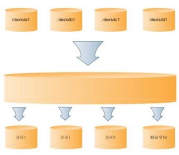

##Linux服务器搭建.md
### [LVM管理](#lvm) 
1.  [LVM简介](#lvm_intro)
2.  [LVM基本术语](#lvm_basic)
3.  [LVM安装](#lvm_install)
4.  [创建和管理LVM](#lvm_create_mana)
    - [创建PV](#pv_create)
    - [创建VG](#vg_create)
    - [创建LV](#lv_create)
    - [LV格式化及挂载](#lv_mount)

------------------------------

<h3 id="lvm">LVM管理</h3>
<h4 id="lvm_intro">1. LVM简介</h4>
LVM是 Logical Volume Manager(逻辑卷管理)的简写，它由Heinz Mauelshagen在Linux 2.4内核上实现。LVM将一个或多个硬盘的分区在逻辑上集合，相当于一个大硬盘来使用，当硬盘的空间不够使用的时候，可以继续将其它的硬盘的分区加入其中，这样可以实现磁盘空间的动态管理，相对于普通的磁盘分区有很大的灵活性。

与传统的磁盘与分区相比，LVM为计算机提供了更高层次的磁盘存储。它使系统管理员可以更方便的为应用与用户分配存储空间。在LVM管理下的存储卷可以按需要随时改变大小与移除(可能需对文件系统工具进行升级)。LVM也允许按用户组对存储卷进行管理，允许管理员用更直观的名称(如"sales'、 'development')代替物理磁盘名(如'sda'、'sdb')来标识存储卷。
如图所示LVM模型： 

<h4 id="lvm_basic">2. LVM基本术语</h4>
<h4 id="lvm_install">3. LVM安装</h4>
<h4 id="lvm_install">4. 创建和管理LVM</h4>

1.  安装git和openssh。在当前用户下执行如下命令安装git和openssh：  
`sudo apt-get install git-core openssh-server openssh-client`

2.  配置git
   - 创建所有代码仓库和用户权限的管理者git，并更改用户的密码。在当前用户下执行：   
     `sudo useradd -m -s /bin/bash git`  
     `sudo passwd git`
   - 创建git仓库的存储目录、更改文件目录属主为代码仓库的管理者git，只让git用户对此目录有权限。本文档以/home/repo目录做为git仓库的存储目录。在当前用户下执行：  
     `sudo mkdir /home/repo`  
     `sudo chown git:git /home/repo`  
     `sudo chmod 700 /home/repo`

<h3 id="ins_gos">安装配置gitosis</h3>  
1.  安装gitosis前准备

 - 初始化git用户。在任何一台机器上使用git，第一次必须初始化一下。在当前用户下初始化全局的git信息：  
 `git config --global user.name "jackliu"` 
 `git config --global user.email "xcltl618@gmail.com"`  
 `git config --global core.editor vim`  
 `git config --global merge.tool vimdiff`  

 - 安装python的setup tool。在当前用户下执行如下命令安装：  
 `sudo apt-get install python-setuptools`

2. 安装gitosis。在当前用户下进行安装，执行如下命令： 

 `cd /tmp`  
 `git clone https://github.com/res0nat0r/gitosis.git`  
 `cd gitosis`  
 `sudo python setup.py install`  
 默认状态下，gitosis会将git仓库放在 git用户的home下，所以我们做一个链接到/home /repo，su到git用户，执行如下命令：  
`ln -s /home/repo /home/git/repositories`  
然后退出git用户。

3. 配置gitosis。如果你是git服务器的管理员，在你的计算机上（最好是另一台PC）来生成访问git服务器的ssh公钥，然后将生成的公钥拷贝到git服务器，执行相关命令来允许你用个人的计算机进行访问和管理git服务器。本文档以liutailin@liutailin-ThinkPad-Edge来做为远程访问和控制git服务器的管理用户。所以在此计算机上的/home/liutailin目录下，执行如下命令：  

 * 在你的PC上选择一个用户做为远程访问及管理git服务器的用户，同时并生成ssh公钥。在选中的用户的home下，执行如下命令：  
 `ssh-keygen -t rsa`

 * 将生成的公钥拷贝到服务器的/tmp下，注意要把<server-IP>改成git服务器对应的IP地址：  
 `scp .ssh/id_rsa.pub git@<server-IP>:/tmp`

 * 回到git服务器/tmp/gitosis目录，执行：  
 `sudo chmod a+r /tmp/id_rsa.pub`

 * 在git服务器上执行如下命令，让gitosis运行起来：  
 `sudo -H -u git gitosis-init < /tmp/id_rsa.pub`  
  会出现如下应答：  
 `Initialized empty Git repository in /home/repo/gitosis-admin.git/`
 `Reinitialized existing Git repository in /home/repo/gitosis-admin.git/` 

 * gitosis通过一个git仓库来管理配置文件，仓库放在/home/repo/gitosis-          admin.git。我们需要为一个文件加上可执行权限，以root用户登录，  
 `cd /home/git/repositories`  
 `cd gitosis-admin.git/`  
 `sudo chmod 755 /home/repo/gitosis-admin.git/hooks/post-update`  
 `exit`

<h3 id="add_new">在git服务器上搭建测试项目库</h3>
1. 建立仓库名“test”的测试仓库。在git服务器上切换到git用户，执行如下命令建立测试仓库：  
`su - git`  
`cd /home/repo`  
`mkdir test.git`  
`cd test.git`  
`git init --bare`  
`exit`  
到目前为止，这只是一个空仓库，空仓库是不能clone的。为了能clone，我们必须先让某个有权限的人放一个初始化的版本到仓库中。所以，我们必须先修改一下gitosis-admin。此时需要
管理gitosis的配置文件。
2. gitosis本身的配置也是通过git来实现的。

* 克隆gitosis-admin.git仓库。  
在git管理员用户目录下，把gitosis-admin.git这个仓库clone下来，接下来我们可以用管理员的身份修改配置了。在git管理员用户目录下执行：
`git clone git@<server>:gitosis-admin.git`  
如果出现：  
`fatal: '~/gitosis-admin.git' does not appear to be a git repository`
`fatal: The remote end hung up unexpectedly`  
改成:  
`sudo git clone git@<Server-IP>:/home/repo/gitosis-admin.git`  

* 拷贝需要访问git服务器的开发用户的ssh公钥
获取仓库后，执行  
`cd gitosis-admin/`  
该目录下的keydir目录是用来存放所有需要访问git服务器的用户的ssh公钥：各个用户按照前面提到的办法生成各自的ssh公钥文件后，把所有人的ssh公钥文件都拿来，按名字命名一下，比如b@pc1.pub, lz@pc2.pub等，统统拷贝到keydir下：  
`su root`  
`cp /path/.ssh/id_rsa.pub ./keydir/b@pc1.pub `  
`exit`

* 修改gitosis.conf文件  
 `[gitosis]`  
 `[group gitosis-admin]`    
 `members = test@liutailin-ThinkPad-Edge ltl@it-c-015`  
 `writable = gitosis-admin`
 ` `  
 ` `    
 `[group hello]`    
 `members = ltl@liutailin-ThinkPad-Edge ltl@it-c-015`  
 `writable = test`

 这个配置文件说明：
    - gitosis-admin组成员有test@liutailin-ThinkPad-Edge, ltl@it-c-015，
      该组对gitosis-admin仓库有读写权限；
    - hello组有test@liutailin-ThinkPad-Edge, ltl@it-c-015两个成员，
      该组对test仓库有读写权限；

 目前这些配置文件的修改只是在你的本地，你必须推送到远程的gitserver上才能真正生效。
加入新文件、提交并push到git服务器：  
`git add .`  
`git commit -am “add test prj and users”`  
`git push origin master`  

<h3 id="test_new">测试搭建的项目库</h3>
 服务器搭建完了，并且有一个空的项目test在服务器上。接下来测试一下，空仓库是不能clone的，所以需要某一个有写权限的人初始化一个版本。下面是在ltl@it-c-015客户端完成。
`mkdir test-ori`  
`cd test-ori/`  
`git init`    
`echo “/*add something*/” > hello`    
`git add .`  
`git commit -am “initial version”`  
`git remote add origin git@<server-ip>:test.git `  
`git push origin master`  
到此,test已经有了一个版本了，test仓库的其他成员只要先clone一下test仓库，就可以进行仓库的开发了。下面是一个用户b来克隆test：   
`su b`  
`cd /home/b`  
`git clone git@<server-ip>:test.git`    
`cd teamwork`    
`vim hello`    
`git add .`      
`git commit -am “b add”`  
`git push origin master`  
`exit`  

<h3 id="add_old">在git服务器上添加已有git项目</h3>
 当我们有一个现成的git仓库，想放到 gitserver上供team使用。以zark仓库为例。 

 - 首先需要从你的工作仓库中得到一个纯仓库, 比如你的工作目录为~/kernel, 你想导出纯仓库到指定路径，然后拷贝到gitserver上去。  
`git clone –bare ~/workspace/zark ~/zark.git`

 - 然后把zark.git 拷贝到git服务器/home/repo/下，同时把zark.git的所有者变更为git
 `scp ~/zark.git git@<server-ip>:/home/repo/`   
 `chown -R git:git /home/repo/zark.git`

 - 同时需要配置 gitosis相关配置文件，增加zark仓库的用户
